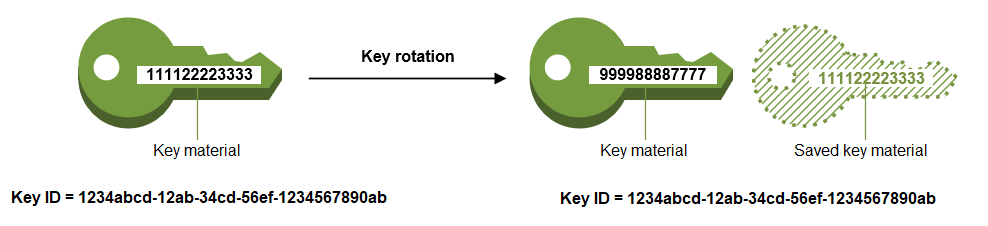

# AWS KMS

AWS Key Management System

<https://docs.aws.amazon.com/ko_kr/kms/latest/developerguide/overview.html>

암호화키 관리 서비스

- 사용자가 접근할 수 없는 관리형 키로 AWS의 다양한 서비스 (RDS, DynamoDB ...) 암호화를 자동실행할 수 있음
- 사용자가 관리하는 키(CMK)로 직접 암/복호화를 수행할 수 있음

## KMS 키 계층구조

- CMK (Client Master Key)

  - HSM(Hardware Security Module): 평문 CMK생성 -> 도메인키로 암호화
  - KMS Host(스토리지): 암호화 CMK 저장

- DataKey

  - HSM: 평문 데이터키 생성 -> 평문 CMK로 암호화
  - 클라이언트: 평문 데이터키 + 암호화 데이터키 수신

- 직접 KMS 암복호화

  - HSM에서 암복호화 수행
  - 원본 데이터는 4KB로 제한됨

### 대칭 DataKey 암복호화

- `GenerateDataKey`: 평문 및 암호화 DataKey 생성

  - 평문키: 데이터 암호화에 사용 후 폐기
  - 암호화키: 복호화를 위해서 암호화 된 데이터와 함께 보관

- `Decrypt`: 암호화 데이터키 복호화 -> 평문 데이터키

### 비대칭 DataKey 암복호화

- `GenerateDateKeyPair`: 암호화 비밀키, 비밀키, 공개키 생성
- `Decrypt`: 암호화 비밀키 복호화 -> 평문 비밀키

### 직접 KMS 암복호화

- `Encrypt`: 평문 암호화 요청
- `Decrypt`: 암호문 복호화 요청

## KMS 키 교체

<https://docs.aws.amazon.com/ko_kr/kms/latest/developerguide/rotate-keys.html>

> KMS 키에 대한 자동 키 교체를 활성화하면 AWS KMS는 매년 KMS 키에 대한 새 암호화 구성 요소를 생성합니다.
> AWS KMS에서 **암호화 구성 요소의 모든 이전 버전이 영구적으로 저장**되므로 해당 KMS 키를 사용하여 암호화된 데이터를 해독할 수 있습니다.
> AWS KMS에서는 KMS 키를 삭제할 때까지 교체된 키 구성 요소가 삭제되지 않습니다.
>
> ...
>
> 교체된 KMS 키를 사용하여 데이터를 암호화하는 경우 AWS KMS는 현재 키 구성 요소를 사용합니다.
> 교체된 KMS 키를 사용하여 암호화 텍스트를 해독하면 AWS KMS는 해당 데이터를 암호화하는 데 사용한 키 구성 요소의 버전을 사용합니다.
> 특정 버전의 키 구성 요소는 요청할 수 없습니다.
>
> ...
>
> 그러나 자동 키 순환은 KMS 키가 보호하는 데이터에는 영향을 주지 않습니다.
> KMS 키에서 생성한 데이터 키를 교체하거나 KMS 키에서 보호하는 데이터를 다시 암호화하지 않으며, 손상된 데이터 키의 영향을 완화하지 않습니다.



### 키를 교체해야 하는 이유

> AWS KMS 256비트 데이터 키가 수백만 개의 메시지를 암호화하면 데이터가 소진되어 미묘한 패턴을 가진 암호문을 생성하기 시작할 수 있습니다.
> 영리한 공격자는 이를 악용하여 키의 비트를 찾아낼 수 있습니다. 이러한 키 소모를 방지하려면 데이터 키를 한 번 또는 몇 번만 사용하는 것이 가장 좋습니다.
> 이렇게 하면 키 자료가 효과적으로 회전됩니다.

## 예제

```ts
test('데이터키 생성 후 복호화', async () => {
  const key = await awsKms.generateDataKey({ KeyId: awsKmsKeyId, KeySpec: 'AES_256' }).promise();

  const plainText = key.Plaintext.toString('hex');
  
  console.log('DEBUG: key plain', plainText.length, plainText);
  // DEBUG: key plain 64 f17fd6182d4a424e3a1fd521f91ccd3e4cb046147e39618a59cd74e6f2c2934e

  const cipherText = key.CiphertextBlob.toString('base64');
  
  console.log('DEBUG: key cipher', cipherText.length, cipherText);
  // DEBUG: key cipher 248 AQIDAHibNNbamTy5G37jNxgsywbPN1PEVfY0WLKWJPEGqaUsHQGyg8meJHuzz2/0TcL79E5UAAAAfiB8BgkqhkiG9w0BBwagbzBtAgEAMGgGCSqGSIb3DQEHATAeBglghkgBZQMEAS4wEQQMx+6hAzlAaXI/z9z5AgEQgDtJgHdda/U8Zr0/4FjJADt2biqDzaqP2UBX8BfKos9TcpxdDew1/e3W6vU9gWi64O/0NNoP85xa7rjS1w==

  const decrypted = await awsKms
    .decrypt({ KeyId: awsKmsKeyId, CiphertextBlob: Buffer.from(cipherText, 'base64') })
    .promise();

  const decryptedText = decrypted.Plaintext.toString('hex');
  
  console.log('DEBUG: decrypted', decryptedText);
  // DEBUG: decrypted f17fd6182d4a424e3a1fd521f91ccd3e4cb046147e39618a59cd74e6f2c2934e

  expect(plainText).toEqual(decryptedText);
});
```
