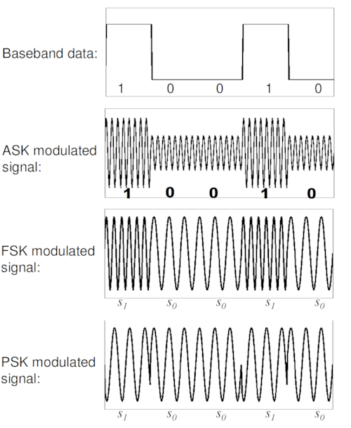

# 정보 통신망

## 컴퓨터 통신망

### 컴퓨터와 통신

#### 분산 시스템 (distributed system)

컴퓨터 자원을 분산시켜 작업을 처리하는 시스템을 분산시스템이라고 한다.

- 강연결 분산시스템: data flow machine, multiprocessor
- 약연결 분산시스템: LAN, MAN, WAN

#### 컴퓨터 통신망의 정의 및 구성요소

좁은 의미에서 통신은 원격통신(telecommunication)을 의미한다.
전자적 신호나 전자기적 파장을 이용하여 정보를 전송하는 것을 뜻한다.

컴퓨터 통신망은 자원과 정보를 공유하기 위해 통신 채널들로 상호 연결된 컴퓨터와 기타 하드웨어 및 소프트웨어 구성요소의 집합체이다.

| 구성 요소 | 설명 |
| -------- | --- |
| 서버(server) | 컴퓨터 통신망에서 특정 서비스를 제공해 주는 컴퓨터 |
| 클라이언트(client) | 서비스를 받고자 하는 컴퓨터 또는 단말(terminal) |
| 전송 매체(transmission media) | 서버와 클라이언트를 상호 연결하고 데이터 전송이 가능하게 하는 장비 (케이블, 광섬유, 라디오파 ...) |
| 네트워킹 장치(networking device) | 서버와 클라이언트를 컴퓨터 통신망에 연결시키기 위해 필요한 연결장치 (허브, 스위치, 라우터, NIC ...) |
| 프로토콜(protocol) | 서버와 클라이언트가 통신하기 위해 미리 정해놓은 규칙(무엇을 언제 어떻게) |
| 애플리케이션(application) | 서버가 클라이언트에게 제공하는 서비스 또는 그것을 위한 프로그램 |

### 데이터 통신 시스템

#### 통신 시스템 모델

데이터 통신 시스템에서 수행되어야 하는 주요 작업들

1. 전송 시스템 활용: 전송 매체의 총 용량을 많은 사용자에게 할당하기 위한 기법들
2. 접속(interface): 신호(전송 시스템으로 전파가능하고, 수신기에서 해석가능한)를 방생시킨다.
3. 동기화: 송/수신기 간의 동기화
4. 교환관리: 교대 전송여부, 데이터 전송량 등의 약속
5. 오류검출 및 정정
6. 흐름제어: 수신측이 데이터를 처리하거나 수신할 수 있는 속도보다 빠르게 송신측의 전송이 이루어지는 경우의 시스템 중단을 방지
7. 주소지정: 전송설비가 2개 이상의 기기에 의해 공유되는 경우 수신측을 유일하게 식별함
8. 라우팅: 데이터의 전송경로 결정
9. 복구: 결함에 의해 작업이 중단된 경우
10. 메시지 형식화: 교환 또는 전송되는 데이터의 원활한 수신을 보장하기 위해
11. 보호
12. 시스템 관리

#### 구성요소

##### 단말장치

Data Terminal Equipment(DTE)란 데이터 통신시스템에서 최종적으로 데이터를 송신하거나 수신하는 기능을 수행하는 장치이다

1. 입출력 기능: 사람이 입력한 데이터를 컴퓨터가 처리할 수 있는 2진 신호로 변환하거나 그 역의 동작을 수행한다
2. 기억 기능: 단말장치에 기억장치를 부가하여 송/수신 데이터를 일시적으로 기억하거나 정보의 자체적/지역적 처리를 수행함
3. 전송제어 기능: 데이터 전송회선으로부터 비트 열을 수신하여 문자로 조립하거나 ETB, ETX등의 전송제어문자를 검출하여 수신 데이터를 검사한 후 단ㅁㅏㄹ장치에 필요한 동작을 취하는 송/수신제어와 오류제어 기능을 수행

##### 데이터 전송회선

1. 신호 변환장치: 대표적 신호 변환장치는 변복조기(modem: 아날로그 신호)과 DSU(Digital Service Unit: 디지털 신호)이 있다
2. 통신회선: 단말장치와 단말장치, 단말장치와 컴퓨터, 컴퓨터와 컴퓨터를 연결, 전화선, 트위스트 페어 케이블, 동축케이블, 광섬유 케이블등이 해당

##### 통신 제어장치

Communication Control Equipment (CCE)는 컴퓨터와 신호변환장치 사이에 위치하며 단말장치와의 통신에 있어 각종 제어 기능을 분담한다.

1. 통신제어장치의 기능: 통신 제어장치는 데이터 전송회선과의 전기적 접속(interface)을 이루며, 문자의 조립/분해 기능과 버퍼링 기능을 갖는다. 또한 오류검출, 오류제어용 확장 비트를 부가시킬 수 있으며, 전송제어 기능과 회선의 감지, 접속제어 기능도 갖는다.
2. 통신제어장치의 작업: 회선 접속부에서는 신호의 형식을 맞추어 접속조건을 갖추며 수신 데이터의 비트샘플링을 행한다. 회선 제어부에서는 수신한 비트를 문자로 조립하고 오류를 검사하며 문자를 모아서 블록을 만들고 오류를 검사한다. 또한 메시지를 조립하여 컴퓨터로 보낸다.

##### 컴퓨터

중앙처리장치에는 통신제어 프로그램이 내장되어 있어 통신 제어장치로부터 입력된 데이터를 처리하고 데이터 통신 시스템 전체르르 제어한다.

#### 통신 소프트웨어

##### 통신 소프트웨어의 기능

1. 데이터 송수신: 컴퓨터와 단말장치의 통신 소프트웨어간 데이터 전송 수행
2. 통신 하드웨어 제어: 통신 하드웨어를 제어하는 드라이버
3. 이용자 접속의 제어: 단말장치의 이용장ㅔ게 데이터 입출력 방식에 관한 절차 제공

##### 통신 소프트웨어의 조건

1. 수시 입력: 통신 소프트웨어는 항상 수신할 수 있는 상태여야 함
2. 데이터의 다양성: 각 처리 방식에 적합한 프로그램과 데이터를 갖추어야 함
    - 거래처리(transaction processing)
    - 시분할 방식(time sharing)
    - 원격일괄처리(remote batch processing)
3. 신속한 응답: 단말장치에서 메시지 송신을 마치고 나서 결과 메시지를 수신할 때까지의 시간(응답시간) 최소화
4. 비동기 처리: 데이터 송수신과 데이터 처리에는 비동기성 존재

#### 통신 프로토콜

통신을 원하는 두 개체간에 무엇을, 어떻게, 언제 통신하도록 할 것인지를 서로 약속한 규약을 통신 프로토콜이라고 한다.
통신 프로토콜은 컴퓨터와 단말장치, 또는 컴퓨터와 컴퓨터 간에 정보교환을 하기 위해 사전에 약속된 통신규약이다.

1. 구문(syntax): 데이터 형식이나 신호수준 ...
2. 의미(semantic): 전송의 조정, 오류관리를 위한 제어정보 포함
3. 타이밍(timing): 전송속도 조절 및 전송순서 조정 ...

##### 통신 프로토콜 종류

대표적으로 TCP/IP가 있으며 그 밖에도 SMTP, HTTP, TCP, IP, UDP, ICMP 등이 있다.

1. TCP(Transmission Control Protocol): IP(Internet Protocol)와 함께 사용되는 프로토콜로, IP가 데이터를 전달하는 동안 TCP는 데이터 패킷을 추적하고 관리한다.
2. IP(Internet Protocol): 송신 호스트와 수신 호스트가 패킷 교환 네트워크에서 정보를 주고받는데 사용. OSI 네트워크 계층에서 호스트의 주소지정과 패킷 분할 및 조립 기능을 담당한다.
3. SMTP(Simple Mail Transfer Protocol): 이메일을 보내고 받는데 사용되는 프로토콜. 수신을 위해서는 POP3나 IMAP 중 하나의 프로토콜을 쓰며, SMTP는 메일 서버에 각 사용자들의 저장 공간을 두어 이메일을 저장한 다음 주기적으로 서버에 접속하여 이메일을 다운로드 하는식으로 작동한다.
4. POP3(Post Office Protocol 3): 이메일을 수신하기 위한 프로토콜, 메일서버가 사용자를 위해 이메일을 수신하고 내용을 보관하기 위해 사용되는 프로토콜이다.
5. HTTP(Hyper-Text Transfer Protocol): HTTP는 클아이언트와 서버 사이에 이루어지는 요청/응답 프로토콜이다.
6. UDP(User Datagram Protocol): TCP와 마찬가지로 한 컴퓨터에서 다른 컴퓨터로 데이터그램이라고 불리는 실제 데이터 단위를 받기위해 IP를 사용한다. TCP와는 달리 메시지를 패킷(데이터그램)으로 나누고 반대편에서 재조립하는 등의 서비스와 도착 데이터 패킷의 순서를 제공하지 않는다.
7. ICMP(Internet Control Message Protocol): IP가 가지고 있는 정보 오류를 수정하거나 보고하지 못한다는 단점보완을 위해 만들어짐. 오류보고 메시지와 질의 메시지의 두 가지 유형이 있다.

#### OSI 모델

데이터 통신에서는 서로 다른 기종 간의 원활한 컴퓨터 통신을 위해 통신의 처리과정을 계층화 하여 각 처리계층에서 수행해야 할 일들을 정확히 정의하였다.

OSI 모델의 기본 목적은 각 계층별로 고유의 역할과 기능을 수행하고, 각 계층은 서로 의존적이지 않고 독립성을 갖도록 설계하는 것이다.

1. 물리계층(physical layer)
2. 데이터링크 계층(data link layer)
3. 네트워크 계층(network layer)
4. 전송 계층(transport layer)
5. 세션 계층(session layer)
6. 표현 계층(presentation layer)

## 데이터 통신의 기초

한 곳에서 다른곳으로 메시지를 보내기위해서는 세 가지의 통신시스템 요소가 필요하다.

1. 메시지를 만들어내는 정보원 (source)
2. 그것을 전송하는 전송매체 (transmission medium)
3. 그 메시지를 받아들이는 수신체 (receiver)

### 변조 및 복조

메시지를 전달하고자 할 때 가장 작은 단위의 정보인 비트를 통신 매체에 맞는 signal로 바구어주어야 한다.

전송 신호를 높은 주파수 대역의 반송파 신호(carrier signal)에 싣는 과정을 변조(modulation)라고 한다.
이때 전송신호를 베이스밴드 신호(baseband signal)라고 하며, 변조의 결과로 얻어진 신호를 변조신호(modulation signal)라 한다.

변조는 베이스밴드 신호에 따라 아날로그 변조와 디지털 변조로 구분된다.

변조방식은 진폭(amplitude), 주파수(frequency), 위상(phase)에 의해
진폭 변조(Amplitude Modulation), 주파수 변조(Frequency Modulation), 위상변조(Phase Modulation)로 구분된다.

변조되어 전달된 신호로부터 반송파 신호를 제거하면 원래 전달하고자 했던 베이스밴드 신호가 남게되며,
이러한 과정을 복조(demodulation)라고 한다.

변조의 주요목적은 전송 매체의 특성에 맞는 형태로 변환하고, 주파수 분할 다중화(Frequency Division Multiplexing)를 위한 것이다.

### 아날로그 변조

 

#### 진폭 변조 (Amplitude Modulation)

진폭 변조는 베이스 밴드 신호의 순간 진폭에 비례하여 반송파 신호의 순간 진폭을 변화시키는 것이다.

변조 신호에서 파형의 제일 높은 값(peak)들을 잇는 선을 포락선(envelope)이라고 하는데,
이는 베이스 밴드의 신호와 그 형태가 같게 된다.

진폭 변조된 신호를 복조할 때 가장 많이 사용되는 방법은 필터링이다.
필터링에는 고주파 통과 필터링(high pass filtering), 저주파 통과 필터링(low pass filtering) 등 여러가지가 있다.

#### 주파수변조 (Frequency Modulation)

주파수 변조는 반송파 신호의 진폭은 일정하게 한 채로 베이스 밴드 신호를 주파수 변화로 변환시키는 방법이다.
따라서 베이스밴드 신호 크기가 클수록 주파수가 높아진다.

#### 위상 변조 (Phase Modulation)

반송파 신호를 베이스밴드의 신호에 따라 변화시킬 때 위상변조는 위상각이 베이스밴드 신호에 따라 선형적으로 변하도록 반송파 신호를 변화시킨다.

### 디지털 변조

디지털 변조에서 가장 중요한 변수는 비트오류율 - BER(Bit Error Rate) 이다. BER은 전체 수신된 비트 수에 대한 오류 비트의 비율이다.

 

#### ASK (Amplitude Shift Keying)

ASK에서는 0과 1의 2진 신호를 서로 다른 진폭을 사용하여 표현한다.

일반적인 방법으로 비트값 1을 나타내는 기잔 중에는 반송파 신호를 흐르게 하고 0을 나타내는 기간중에는 반송파 신호를 흐르지 않게 하는 방법이 사용된다.
이러한 변조방식을 OOK(On-Off Keying)라고 한다.

ASK는 신호와 잡음의 비가 높은 상태에서는 수신측에서 반송파 신호의 흐름여부를 구별하기 어렵다는 단접이 있다.

#### FSK (Frequency Shift Keying)

0과 1을 서로 다른 주파수를 이용하여 서로 다른 상태로 표시한다.

FSK는 상대적으로 잡음의 영향을 적게 받는다. 하지만 0과 1을 각각 나타내는 두 반송파 신호의 주파수 차이가 크지 않다면 수신측 복조 과정에서 0과 1을 정확히 식별하지 못할 수 있다.

또한 FSK는 ASK와 달리 기본적으로 2개의 반송파 신호를 요구하므로 실제 전송률은 ASK 보다 두 배 적다.

#### PSK (Phase Shift Keying)

PSK는 정현파(혹은 사인파)의 한 주기로 하나의 비트를 표현할 수 있다.
따라서 ASK나 FSK처럼 하나의 비트를 표현하기 위해서 2주기 또는 3주기 이상의 정현파를 사용하는 것보다 높은 전송률을 보인다.

PSK는 0과 1의 두 가지 비트 상태를 표현하기 위해 반송파 신호의 위상을 변화시킨다.

### 정보의 디지털화와 변조

#### 펄스, 펄스 변조, 펄스 진폭 변조

펄스(Pulse)란 매우 짧은 시간 동안 진행되는 네모꼴의 전자기 파형을 말한다.
펄스는 진폭, 펄스의 폭, 시간에 따른 상대적 위치가 있다.

펄스 변조(PM)는 추출된 표본의 크기에 따라 펄스의 특정 변수인 진폭, 위치, 폭을 변화시키는 방법을 말한다

#### 펄스 코드 변조 (Pulse Code Modulation : PCM)

아날로그 베이스밴드 신호의 진폭과 펄스 신호의 진폭을 곱하여 PAM 펄스를 만들고 이로부터 양자화 과정을 통하여 코드화된 디지털 신호를 만드는 펄스 변조를 펄스 코드 변조라고 한다.

PCM은 아날로그 신호를 일정한 간격으로 sampling하고, 각 표본의 진폭을 PAM 펄스로 나타낸다.

PCM  펄스를 만들기 위해서는 PAM 펄스들을 일정 개수의 비트 단위로 양자화(quantization)를 수행해야 한다.

PCM을 통하여 아날로그 신호를 디지털 신호로 바꾸는 고정을 표본화 과정, 양자화 과정, 부호화 과정으로 나눌 수 있다.

##### 표본화 과정

표본 주파수는 적어도 아날로그 신호의 가장 큰 주파수의 두 배가 되어야 한다는 나이퀴스트 표본화 정리를 따른다.

아날로그 신호 `x(t)`를 표본화 하면 디지털신호인 `x(nT)`가 얻어진다.
이때 `T`를 표본화 주기라하면, 표본화 주파수 `1/T`를 표본화율이라고 한다.

아날로그 신호를 디지털 신호로 변환하기 위해서는 우선 아날로그 신호를 일정한 간격(`T`)로 표본화 해야한다.
일정한 간격으로 표본화된 원래 신호의 진폭 하나를 표본(sample)이라고 한다.

단위 시간동안 추출된 표본의 수를 표본화 주파수라고 하는데, 표본화 주파수가 커질수록 표본화된 신호는 원래의 아날로그 신호에 가까워진다.

##### 양자화 과정

표본화 과정을 거친 표본값을 단계적으로 근사시키는 과정을 양자화 과정이라고 한다.

연속 신호를 단계값으로 표현하면 오차가 발생하는데, 원래 신호와 양자화 신호와의 오차를 양자화 오차라고 한다.
양자화 과정중에 원래 신호의 왜곡 현상을 막기 위해서는 신호의 성질과 상태에 따라서 양자화의 단계 수를 조절해야 한다.

##### 부호화 과정

부호화(encoding)는 양자화 과정을 거쳐 만들어진 단계값들을 0과 1로 구성된 부호로 만드는 과정이다.

이때 부호화하려는 표본화 단계(M)와 부호화 비트 수(N)와는 다음 관계식을 가진다: `2^N >= M`

### 전송코드

#### Baudot 코드

Baudot 코드는 5비트로 구성되어 있고, 5비트 코드로는 32글자 밖에 나타낼 수 없으므로 이 글자 중 2개를 코드 확장 기능을 갖는 글자로 이요함으로써 표현할 수 있는 문자를 확장시키고 있다.

5비트 모두가 정보 표현을 위해 사용되고 있어서 오류 검출을 위한 비트를 별도로 갖고 있지 않다.

#### ASCII (American Standard Code for Information Interchange) 코드

ASCII 코드는 7비트의 정보와 패리티(parity)검사를 위한 1비트로 구성된 8비트 코드이다.

정보비트가 7비트로 구성되어 있기 때문에 표현할 수 있는 총 문자개수는 128개이며, 여기에 대문자, 소문자, 숫자 뿐 아니라 특수 제어문자 등도 포함하고 있다.

##### 제어문자

ASCII 코드에는 7/15의 DEL 문자를 제외하면 모두 32개의 제어문자가 있다. 제어문자는 크게 네 가지로 분류된다.

###### 포맷 제어문자

포맷 제어(foramt effector)를 위해 6개의 문자가 사용되고 있으며 FE0~FE5로 표시되어 있다.

| 문자 | 용도                  |
| ---- | --------------------- |
| FE0  | Back Space            |
| FE1  | Horizontal Tabulation |
| FE2  | Line Feed             |
| FE3  | Vertical Tabulation   |
| FE4  | Form Feed             |
| FE5  | Carriage Return       |

특정 단말은 LF와 CR을 동시에 수행하는 기능이 있는데 이 기능을 NL(New Line)이라 하며 FE2에 의해 행해진다.

###### 장치 제어문자

단말기의 물리적 기능을 제어하는데 사용된다. DC1~DC4에 해당하는 장치제어 문자가 있다.

| 문자 | 용도                                                |
| ---- | --------------------------------------------------- |
| DC1  | 카세트 레코드 On                                    |
| DC2  | 카세트 레코드 Off                                   |
| DC3  | 영상 화면 단말기의 키보드 내용을 보조 프린터에 인쇄 |
| DC4  | 영상 화면 단말기의 키보드 Lock                      |

장치 제어문자의 기능은 제조업자에 따라 다르다

###### 정보분리 제어문자

컴퓨터가 다루기 쉽도록 정보를 논리적인 요소로 분리하는데 사용된다.

| 문자 | 용도                                                     |
| ---- | -------------------------------------------------------- |
| IS1  | 정보의 기본단위(unit)를 가려내는데 사용 (Unit Separator) |
| IS2  | 정보를 경계짓는데 사용 (Record Separator)                |
| IS3  | 레코드 그룹을 경게짓는데 사용 (Group Separator)          |
| IS4  | 파일을 경계짓는데 사용 (File Separator)                  |

###### 전송제어문자

전송 제어문자는 메시지를 쉽게 인식할 수 있는 포맷이나 수신장치에 의해 쉽게 다루어질 수 있는 프레임으로 나누는데 사용된다.
또한 데이터의 흐름을 제어하는데 도움을 주기 위해 사용된다.

##### 패리티 비트

ASCII 문자의 비트8은 패리티 비트이다. 패리티 비트(parity bit)는 전송 도중에 발생하는 오류를 검출하는 데 사용된다.

홀수 패리티의 경우에 비트 8은 문자 내에 1의 개수를 전부 합하여 홀수가 되도록 정해지며, 짝수 패리티의 경우에는 1의 개수가 짝수가 되도록 정해진다.

만약 2개의 비트에 대한 전송오류가 일어났다면 수신측 오류를 검출하지 못하는 경우가 발생한다.
다라서 여러 개의 오류를 검출하기 위해서는 좀 더 복잡한 기법이 필요하다.

#### 유니코드

##### 등장배경

기존 문자 처리 체계는 8비트로 이루어져 복잡한 문자체계를 가진 곳에서는 16비트 단위로 데이터를 표현해야 하는 문제가 있었다.

이를 변환하는데 어려움이 있고, 호환성/확정성에 문제가 있어 이를 해결하기 위한 방법으로 유니코드가 제안되었다.

##### 유니코드의 정의

데이터의 교환을 원활하게 하기 위하여 문자 1개에 부여되는 값을 16비트로 통일하고 전세계에서 사용하고 있는 26개 언어의 문자와 특수기호에 대해 코드값을 부여하였다.

##### 유니코드의 구조

유니코드의 구조는 크게 17개의 언어판으로 구성되어 있고 각 언어판은 2^16개의 문자를 지정할 수 있다. 따라서 지정가능한 최대 문자 수는 `17 * 65,536 = 114,112`개 이다.
하지만 대행 코드 영역(surrogates) 2,048개를 제외해야 하므로 실제로는 112,064개의 문자를 지정할 수 있다.

유니코드 표준 3.1에서는 기본 언어판에 49.196개 문자를 정의하였고, 보충 언어판에 44,944개의 문자를 추가하였다.
보충 언어판에 추가된 문자로는 음표, 고대 문자, 한자 등이다.

##### 용어

1. 기본 언어판(basic multilingual plane): 유니코드의 첫 65,536개의 문자
2. 언어판(plane): 65,536개의 문자 묶음으로 유니코드에서는 17개의 언어판을 사용할 수 있다.
3. 언어판 그룹: 256개씩의 언어판을 묶어 그룹으로 명명한다. 유니코드에서는 17개의 언어판 모두 그룹 00에 있다.
4. UCS-2(Universal Character Set 2(octets)): ISO/IEC 10646의 용어로 기본 언어판의 65,536코드만 정의하여, 2바이트로 펴현된다.
5. UCS-4: ISO/IEC 10646의 용어로 128개의 언어판 그룹을 정의하여 2,147,483,648개의 문자가 되며 4바이트로 표현된다.
6. 인코딩: 문자집합을 표현하는 방식으로 유니코드는 UTF-8, UTF-16, UTF-32 등과 같은 인코딩이 필요하다
   - UTF(UCS Transformation Format)-8 유니코드 한 문자를 나타내기 위해 1바이트에서 4바이트까지 가변인코딩
   - UTF-16: UCS-2와 거의 동일하며 인코딩 단위는 2바이트로, 기본 언어판에 속해 있는 문자들은 그대로 16비트 값으로 인코딩 되고 그 이상의 문자는 특별히 정해진 32비트로 인코딩 된다
   - UTF-32: 4바이트의 고정길이로 각 문자를 표현하지만 17개의 언어판만을 정의한다는 점에서는 UCS-4의 부분집합으로 볼 수 있다.

#### BCD (Binary Coded Decimal) 코드

컴퓨터 내부의 코드로 10진 숫자를 표시하기 위해 많이 사용된다

#### EBCDIC (Extended Binary Coded Decimal Interchange Code) 코드

8비트 코드로서, 8비트 전체가 정보를 위해 사용되고 있다. ASCII 코드보다 두 배의 문자를 표현할 수 있다. (에러검출X)

### 전송방식

#### 전송방향

##### 단방향 전송 (simplex transmission)

단방향 전송은 한 방향으로만 정보를 전달하고자 할 때 사용된다.
단방향 전송의 방향은 채널의 끝에 있는 장치의 특성에 의해 결정된다.

##### 반이중 전송 (half-duplex transmission)

반이중 전송은 정보의 전달 방향이 교대로 이루어지는 통신방식을 의미한다.

1. 각 방향별로 통신 채널이 필요하므로 2개의 통신 채널을 사용한다
2. 정보 흐름 방향을 바꾸기 위해서는 일정량의 시간을 필요로한다. 어느 한 방향의 통신이 끝났다는 것을 인지하는 반응시간과 전파가 방향을 바꾸어 돌아오는데 걸리는 선로회귀시간이 필요하다

##### 전이중 전송 (full-duplex transmission)

단방향 전송에서 사용하는 채널을 2개 이용한다면 동시에 양방향으로 정보를 주고 받을 수 있다.

#### 전송 모드

병렬전송에서는 부호회된 코드의 모든 비트가 동시에 전송된다. 이 방식은 코드의 각 비트마다 개별적으로 할당된 채널을 이용하여 데이터를 전송하는 것을 의미한다.

병렬 전송은 장치와 장치사이의 데이터 전송에 주로 사용된다.

일반적으로 먼 거리 전송에서는 채널의 비용 부담 때문에 주로 직렬 전송을 이용한다.

#### 전송 동기 (Synchronization)

##### 비트 동기 (bit synchronization)

비트 동기는 통신선로 양쪽에 클록(clock)을 놓음으로써 해결할 수 있다.
송신측의 클록은 비트를 언제 통신선로에 보낼 것인가를  말하고, 수신측의 클록은 비트를 언제 검출할 것인가를 말해준다.

대다수의 시스템에서 1은 전송선로에 전류가 흐르는 것으로 표현되고 0은 전류가 흐르지 않는 것으로 표현된다.
만약 전송 선로의 상태가 변하는 순간에 비트를 검출하게 되면 불확실한 결과를 얻게 되므로, 비트의 검출은 비트의 중간지점에서 이루어진다.

어떤 시스템에서는 송신측이 자신의 타이밍 신호를 수신측에 전송하여 수신측 클록을 송신측 클록과 맞추도록 하는 방법을 사용하기도 한다.

##### 문자 동기 (character synchronization)

비트 동기를 이루었다 하더라도 비트를 그룹지어 문자를 형성하는 문자동기를 이루어야 한다.
이 문제는 어느 비트가 글자의 첫 번째인지 결정하는 문제이다.

###### 동기식 전송

동기식 전송은 데이터의 전 블록을 한꺼번에 전송한다. 동기식 전송에서는 모든 비트의 시간적 길이가 같으며, 한 글자의 마지막 비트와 다음 글자 시작 비트 사이의 시간 간격은 아주 없거나 한 글자 전송 시간의 배수에 해당하는 길이를 갖는다.

예를 들어, ASCII 코드의 경우에 각 글자는 8비트를 갖는다. 첫 번째 글자의 첫 번째 비트를 결정한 후에는 수신측은 8비트들의 각 그룹들을 셀 수 있고, 들어오는 메시지를 조합해 낼 수 있다. 이를 위해서 ASCII 코드의 동기식 전송인 경우 SYN(ASCII 코드표에서 1/06) 전송제어 문자를 사용한다.

SYN 문자는 00010110(홀수패리티 경우)의 비트 패턴을 갖고 수신측은 가장 최근에 받은 8비트를 표본화 하여 SYN 패턴과 비교하여 SYN 패턴을 검출한다.

하지만 앞글자와 뒷글자가 합쳐져 SYN 패턴을 형성하는 경우 문제가 발생할 수 있다. 이런 경우를 false synchronization 이라고 하며 이를 방지 하기 위해서 메시지 앞에 여러개의 SYN 글자를 놓는 것이 보통이다.

동기화를 이루는 방법에는 여러가지 변형이 있다.
예를 들어 연속 2개의 SYN 대신에 서로다른 2개의 동기패턴을 이용하기도 한다. 2진 시스템에서 이러한 동기 패턴을 flag라고 하며, 모든 경우에 수신측은 데이터 블록 앞에 있는 특별한 형태의 비트 패턴을 확인할 수 있어야 한다.

동기식 시스템에서 많은 글자를 전송할 때 버퍼가 있는 단말기를 사용한다.

###### 비동기식 전송

비동기식 전송은 한 글자씩 전송되고 글자와 글자 사이에 특별한 시간적 관계가 없는 경우에 사용된다.
글자와 글자 사이에 시간적 간격울 둘 경우 수신측은 각 글자에 동기를 이루어야 한다. 이것은 매 글자 앞에 start pulse를 둠으로써 비트를 인식할 수 있다.

전송선로가 유휴 상태로 진행될 때에는 송신측은 연속적인 1을 수신측으로 보낸다.
송신측이 글자를 보내기 원할 때에는 글자 앞에 시작 비트를 놓음으로써 수신측에 그다음 정보 비트가 있다는 것을 알린다.
수신측은 1상태에서 0상태로의 transition을 검출하여 클록을 시작한다.

각 글자의 끝에는 stop pulse를 두어 수신측으로 하여금 다른 글자를 받아들이기 전에 안정 상태에 들어가도록 한다.

### 전송 효율

전송 효율은 통신선의 사용 효율을 이야기한다.
비동기 전송의 경우에는 전송된 총 비트 수에 시작 비트와 정지 비트가 추가되기 때문에 동기 전송이 효율이 좋다.

`전송효율 = (정보 비트수 / 총 전송 비트수) * 100%`

예를 들어 240개의 ASCII 글자 블록의 전송에 대하여 동기식과 비동기식 전송효율 비교해보자.
동기식 전송인 경우 데이터의 각 블록 앞에 3개의 SYN 글자를 이용한다고 가정하면

```text
240 글자 X 8비트/글자 = 1920비트
3 SYN 글자 X 8비트/글자 = 24비트

(1920/1944)*100 = 98.76%
```

비동기식 전송인 경우 각 글자마다 2개의 오버헤드 비트(시작/정지 펄스)가 필요하므로

```text
240 글자 X 8비트/글자 = 1920 비트
240 글자 X 2비트/글자 = 480 비트

(1920/2400)*100 = 80%
```

일반적으로 동기식 전송은 비동기식 보다 통신 채널을 효율적으로 사용한다.
반면 비동기식 전송은 비싸지 않고 복잡하지 않은 장비로 낮은 속도의 전송에 사용될 수 있다.

## 데이터 통신의 요소

### 통신선로
