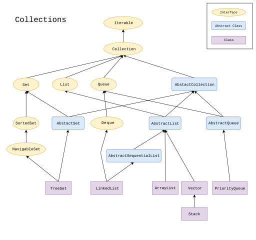

# Collections Framework

## hierarchy

### Collection

### Map

- java.util.SortedMap: key가 ascending order로 정렬된 map
- java.util.NavigableMap

## 종류

| Interface | Hash Table | Resizable Array | Balanced Tree | List | Hash Table + Linked List |
| --- | --- | --- | --- | --- | --- |
| Set | HashSet |  | TreeSet |  | LinkedHashSet|
| List |  | ArrayList |  | LinkedList |  |
| Deque |  | ArrayDeque |  | LinkedList |  |
| Map | HashMap |  | TreeMap |  | LinkedHashMap |

## 변환

## 생성
