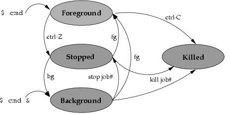

# Linux Jobs

터미널에서 실행한 명령은 세 가지 상태를 가질 수 있다

- foreground
- stopped
- background



## background 상태로 명령어 시작

실행하는 명령어 끝에 `&` 문자를 추가한다

```sh
bash foo_script.bash &
```

> nohup(no hang up) 명령어는 background 명령어와는 별개로 터미널 세션을 종료할 때 발생하는 SIGHUP 시그널로 인한 프로세스 종료를 방지한다.
> (따라서, foreground 상태에서도 사용가능)

## backgroud 작업을 foreground 전환

- `jobs` 명령어 호출로 작업번호 확인
- `fg %<작업번호>` 실행

## foreground 작업을 background 전환

- `ctrl + z`를 눌러 프로세스 상태를 `stopped`로 전환
- `bg` 명령어 호출

## foreground 명령 `nohup` + background 전환

<https://stackoverflow.com/questions/625409/how-do-i-put-an-already-running-process-under-nohup>

- Ctrl+Z to stop (pause) the program and get back to the shell.
- `bg` to run it in the background.
- `disown -h [job-spec]` where [job-spec] is the job number (like `%1` for the first running job; find about your number with the `jobs` command) so that the job isn't killed when the terminal closes.

### 분리여부 확인

<https://superuser.com/questions/1196406/linux-view-and-kill-disowned-process>

- `jobs -l`
- 터미널 종료 후
- `pstree -s -p <PID>`
