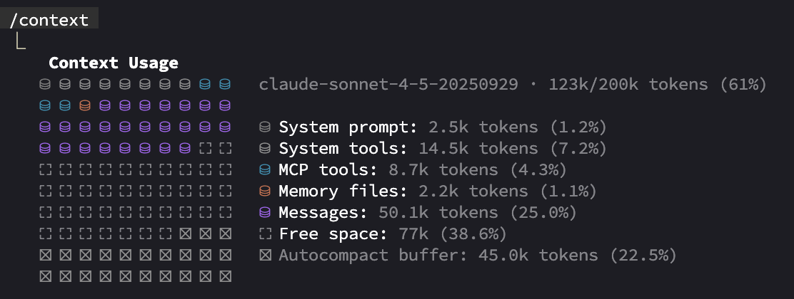

# Agents

- <https://github.com/zed-industries/agent-client-protocol>
- <https://containers.dev/> (agent 실행환경 격리)
  - <https://code.visualstudio.com/docs/devcontainers/containers>
  - <https://zed.dev/docs/dev-containers>
- <https://docs.docker.com/reference/cli/docker/sandbox/run/>
- <https://github.com/anthropic-experimental/sandbox-runtime>
- <https://github.com/dagger/container-use> (agent 실행환경 격리, 병렬작업)
- <https://github.com/superagent-ai/vibekit> (safety layer for your coding agent)
- <https://github.com/router-for-me/CLIProxyAPI>
  - <https://github.com/automazeio/vibeproxy>
  - <https://github.com/kaitranntt/ccs>

## [[vs-code]] Github Copilot Chat

- <https://github.com/github/awesome-copilot>

### Github Copilot Chat Prompts

- [[vs-code#Prompt]]
- <https://github.com/microsoft/vscode-copilot-chat/blob/main/src/extension/prompts/node/agent/agentPrompt.tsx>

## [[cursor]]

- [[cursor#Prompt]]
- <https://docs.cursor.com/ko/welcome>

## Gemini CLI

- <https://github.com/google-gemini/gemini-cli>
- <https://geminicli.com/extensions/>

### Gemini CLI Prompts

- <https://github.com/google-gemini/gemini-cli/blob/main/packages/core/src/core/prompts.ts>
- <https://gist.github.com/simonw/9e5f13665b3112cea00035df7da696c6>

### Gemini CLI Privacy

- <https://github.com/google-gemini/gemini-cli/blob/main/docs/tos-privacy.md>
- <https://github.com/google-gemini/gemini-cli/blob/main/docs/telemetry.md>
- <https://github.com/google-gemini/gemini-cli/blob/main/docs/cli/configuration.md#usage-statistics>
- <https://news.ycombinator.com/item?id=44379036>

> 개인용 Gemini Code Assist를 사용하면 Google에서 프롬프트, 관련 코드, 생성된 출력, 코드 수정사항, 관련 기능 사용 정보, 사용자 의견을 수집하여 Google 제품 및 서비스, 머신러닝 기술을 제공, 개선, 개발하는 데 사용합니다.
> ... 중략 ...
> 이 데이터가 Google의 머신러닝 모델을 개선하는 데 사용되지 않도록 하려면 개인을 위한 Gemini Code Assist 설정의 단계에 따라 선택 해제할 수 있습니다.

- CLI 에서 [`/privacy` slash command](https://github.com/google-gemini/gemini-cli/pull/2059) 사용 가능
- VSCode 등의 Code Assist 확장 Privacy Settings 사용 가능

### Gemini Code Assist ToS

- <https://developers.google.com/gemini-code-assist/resources/plugin-license?hl=ko>
- <https://developers.google.com/gemini-code-assist/resources/privacy-notice-gemini-code-assist-individuals?hl=ko>

### Gemini CLI for google workspace account

<https://github.com/google-gemini/gemini-cli/blob/main/docs/get-started/authentication.md#optional-set-your-google-cloud-project>

## Claude Code

> closed source

- <https://github.com/anthropics/claude-code>
- <https://github.com/zebbern/claude-code-guide>
- <https://github.com/hesreallyhim/awesome-claude-code>

### Claude Code Privacy

- <https://privacy.anthropic.com/en/articles/10023580-is-my-data-used-for-model-training>
- <https://docs.anthropic.com/en/docs/claude-code/security>
- <https://github.com/anthropics/claude-code?tab=readme-ov-file#data-collection-usage-and-retention>

consumer products
> We will not use your Inputs or Outputs to train our generative models (i.e. Claude), unless you’ve explicitly reported the materials to us (for example via our feedback mechanisms as noted below) or you’ve explicitly opted in to training (for example by joining our trusted tester program).

commercial products
> By default, we will not use your inputs or outputs from our commercial products to train our models.

claude code
> We may use feedback to improve our products and services, but we will not train generative models using your feedback from Claude Code. Given their potentially sensitive nature, we store user feedback transcripts for only 30 days.

### Claude Prompts

- <https://platform.claude.com/docs/ko/release-notes/system-prompts>
- <https://github.com/marckrenn/cc-mvp-prompts>
- [Document the difference between ultrathink and Thinking Mode On/Off](https://github.com/anthropics/claude-code/issues/9072)

### Claude Code Context

> 클로드 코드에 추가된 `/context` 명령어를 실행해보면 context 구성을 확인해 볼 수 있다

- tool search tool
  - <https://www.anthropic.com/engineering/advanced-tool-use>
  - <https://news.ycombinator.com/item?id=46038047>

## Codex CLI

<https://github.com/openai/codex>

### Codex CLI Prompts

- <https://github.com/openai/codex/blob/main/codex-rs/core/prompt.md>
- <https://github.com/openai/codex/blob/main/codex-rs/core/gpt-5.1-codex-max_prompt.md>

### Codex CLI plan mode

- <https://github.com/openai/codex/issues/2101>
- <https://github.com/openai/codex/discussions/7355>
- <https://cookbook.openai.com/articles/codex_exec_plans>
- skills 추가하면서 plan skill 내장됨

### Codex CLI tips

- [subagent hacking](https://www.youtube.com/watch?v=5eJqXtevlXg)

## opencode

<https://github.com/sst/opencode>

### opencode CLI Prompts

<https://github.com/sst/opencode/tree/dev/packages/opencode/src/session/prompt>

### opencode plugins

- <https://github.com/numman-ali/opencode-openai-codex-auth>

## Kiro

<https://kiro.dev/docs/getting-started/>

### Set Up Steering Files (AGENTS.md ...)

Kiro는 핵심 프로젝트 컨텍스트를 설정하는 세 가지 필수 파일을 자동으로 생성합니다:

- 제품 개요(product.md): 제품의 목적, 목표 사용자, 주요 기능 및 비즈니스 목표를 정의합니다. 이는 Kiro가 기술적 결정의 "이유"를 이해하고 제품 목표에 부합하는 솔루션을 제안하는 데 도움이 됩니다.
- 기술 스택(tech.md): 선택한 프레임워크, 라이브러리, 개발 도구 및 기술적 제약 사항을 문서화합니다. Kiro가 구현을 제안할 때, 다른 대안보다 확립된 스택을 선호합니다.
- 프로젝트 구조(structure.md): 파일 구성, 명명 규칙, 가져오기 패턴 및 아키텍처 결정을 요약합니다. 이를 통해 생성된 코드가 기존 코드베이스에 원활하게 통합될 수 있습니다.

### Build Features with Specs

사양(Specs)은 다음 세 단계를 거쳐 높은 수준의 기능 아이디어를 상세한 구현 계획으로 전환합니다.

- 요구사항(Requirements): EARS 표기법을 사용한 인수 기준을 포함하는 사용자 스토리
- 설계(Design): 기술 아키텍처 및 구현 접근 방식
- 작업(Tasks): 개별적이고 추적 가능한 구현 단계

## crush

<https://github.com/charmbracelet/crush>

> AI coding agent for your favourite terminal

## forge

<https://github.com/antinomyhq/forge>

> AI enabled pair programmer for Claude, GPT, O Series, Grok, Deepseek, Gemini and 300+ models
